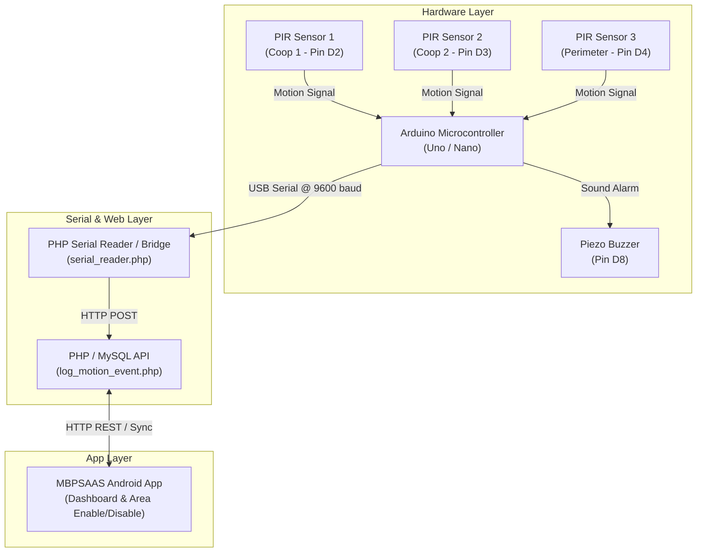

# MBPSAAS — 3 PIR Sensor & Hardware Wiring Diagram

This document contains the complete circuit wiring diagrams, pinout configurations, and schematic layout for the 3 PIR Motion Sensor areas (**Coop 1**, **Coop 2**, **Perimeter**) and the Alarm Buzzer.

---

## 1. System Block Diagram



---

## 2. Component Requirements

| Component | Quantity | Description / Model |
|---|---|---|
| Microcontroller | 1 | Arduino Uno R3 / Nano / ESP32 |
| PIR Motion Sensor | 3 | HC-SR501 Passive Infrared Sensors |
| Alarm Actuator | 1 | 5V Active Piezo Electric Buzzer |
| Status Indicator | 1 | 5mm LED (Red or Green) |
| Current Resistor | 1 | 220Ω Resistor (for LED) |
| Power Supply | 1 | 5V DC via USB or External 7-12V Power Jack |
| Wiring | — | Male-to-Female / Male-to-Male Jumper Wires |

---

## 3. Pinout Connection Table

| Device | Device Pin | Arduino Pin | Wire Color (Rec.) | Function / Description |
|---|---|---|---|---|
| **PIR Sensor 1** (Coop 1) | VCC | 5V | Red | 5V Power Supply |
| | GND | GND | Black | Common Ground |
| | OUT | **D2** | Yellow | Digital Motion Interrupt Output |
| **PIR Sensor 2** (Coop 2) | VCC | 5V | Red | 5V Power Supply |
| | GND | GND | Black | Common Ground |
| | OUT | **D3** | Blue | Digital Motion Interrupt Output |
| **PIR Sensor 3** (Perimeter) | VCC | 5V | Red | 5V Power Supply |
| | GND | GND | Black | Common Ground |
| | OUT | **D4** | Green | Digital Motion Interrupt Output |
| **Piezo Buzzer** | Positive (+) | **D8** | Orange | Alarm Signal Drive Pin |
| | Negative (-) | GND | Black | Common Ground |
| **Status LED** | Anode (+) | **D13** (via 220Ω) | White | System Status & Alert Indicator |
| | Cathode (-) | GND | Black | Common Ground |

---

## 4. Visual ASCII Circuit Schematic

```
                                 +-------------------------+
                                 |       ARDUINO UNO       |
                                 |                         |
  +------------------+           |                         |
  | PIR 1 (COOP 1)   |           |                         |
  | [VCC] ---------- | --------- | [5V]                    |
  | [GND] ---------- | --------- | [GND]                   |
  | [OUT] ---------- | --------- | [D2]                    |
  +------------------+           |                         |
                                 |                         |
  +------------------+           |                         |
  | PIR 2 (COOP 2)   |           |                         |
  | [VCC] ---------- | --------- | [5V]                    |
  | [GND] ---------- | --------- | [GND]                   |
  | [OUT] ---------- | --------- | [D3]                    |
  +------------------+           |                         |
                                 |                         |
  +------------------+           |                         |
  | PIR 3 (PERIMETER)|           |                         |
  | [VCC] ---------- | --------- | [5V]                    |
  | [GND] ---------- | --------- | [GND]                   |
  | [OUT] ---------- | --------- | [D4]                    |
  +------------------+           |                         |
                                 |                         |
  +------------------+           |                         |
  | PIEZO BUZZER     |           |                         |
  | [(+) POSITIVE] - | --------- | [D8]                    |
  | [(-) NEGATIVE] - | --------- | [GND]                   |
  +------------------+           |                         |
                                 |                         |
  +------------------+           |                         |
  | STATUS LED       |           |                         |
  | [(+) ANODE] --- [220Ω] ----- | [D13]                   |
  | [(-) CATHODE] -- | --------- | [GND]                   |
  +------------------+           +-------------------------+
```

---

## 5. Serial Token Protocol

When motion is detected or cleared by any of the 3 PIR sensors, the Arduino broadcasts string tokens over USB Serial at **9600 Baud**:

| Event Source | Sensor Area | Serial Token Sent | Action / Trigger |
|---|---|---|---|
| Sensor 1 High | Coop 1 | `COOP1_MOTION_DETECTED` | Sounds Buzzer + Logs Alert for Coop 1 |
| Sensor 1 Low | Coop 1 | `COOP1_MOTION_STOPPED` | Stops Alert for Coop 1 |
| Sensor 2 High | Coop 2 | `COOP2_MOTION_DETECTED` | Sounds Buzzer + Logs Alert for Coop 2 |
| Sensor 2 Low | Coop 2 | `COOP2_MOTION_STOPPED` | Stops Alert for Coop 2 |
| Sensor 3 High | Perimeter | `PERIMETER_MOTION_DETECTED` | Sounds Buzzer + Logs Alert for Perimeter |
| Sensor 3 Low | Perimeter | `PERIMETER_MOTION_STOPPED` | Stops Alert for Perimeter |

---

## 6. Sensor Enable / Disable Control Integration

In the Android mobile app, each sensor area can be individually enabled or disabled:
- **Coop 1 - PIR Sensor** (`COOP1`) [Switch: ON/OFF]
- **Coop 2 - PIR Sensor** (`COOP2`) [Switch: ON/OFF]
- **Perimeter - PIR Sensor** (`PERIMETER`) [Switch: ON/OFF]

When a sensor area is **Disabled** in the app:
1. The backend API stores `is_enabled = 0` in table `sensor_zones`.
2. Motion events for that area are ignored or flagged as disabled, keeping the system free of false alarms for inactive coops/areas.
